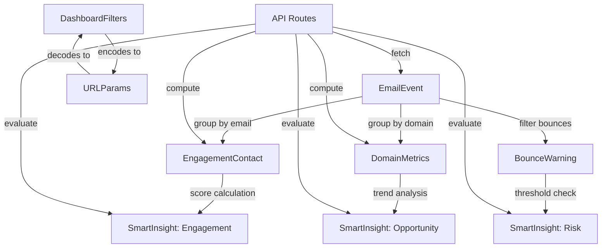

# Data Model: Lead Generation Analytics & Insights

**Date**: 2025-10-05  
**Plan**: [plan-lead-gen.md](./plan-lead-gen.md)  
**Research**: [research-lead-gen.md](./research-lead-gen.md)

## Database Schema Changes

### Supabase Migration: email_domain Computed Column

```sql
-- Migration: add_email_domain_column
-- Applied via Supabase MCP

ALTER TABLE sendgrid_events 
ADD COLUMN IF NOT EXISTS email_domain TEXT 
GENERATED ALWAYS AS (
  SUBSTRING("Email" FROM '@(.*)$')
) STORED;

-- Indexes for performance
CREATE INDEX IF NOT EXISTS idx_sendgrid_events_email_domain 
ON sendgrid_events(email_domain);

CREATE INDEX IF NOT EXISTS idx_sendgrid_events_email 
ON sendgrid_events("Email");

CREATE INDEX IF NOT EXISTS idx_sendgrid_events_event 
ON sendgrid_events("Event");

-- Verify indexes
SELECT indexname, indexdef 
FROM pg_indexes 
WHERE tablename = 'sendgrid_events';
```

**Impact**: Enables fast domain-level aggregations without application logic

---

## TypeScript Type Definitions

### 1. Existing Types (No Changes)

```typescript
// src/types/index.ts

export type EventType =
  | "processed"
  | "delivered"
  | "open"
  | "click"
  | "bounce"
  | "deferred"
  | "dropped"
  | "unsubscribe"
  | "spamreport"
  | "block";

export interface EmailEvent {
  unique_id: number;
  sg_event_id: string;
  email: string;
  event: EventType;
  timestamp: Date;
  category: string[];
  smtp_id?: string;
  email_account_id?: string;
}

export interface DailyAggregate {
  date: string; // YYYY-MM-DD
  requests: number;
  delivered: number;
  opens: number;
  unique_opens: number;
  clicks: number;
  unique_clicks: number;
  unsubscribes: number;
  bounces: number;
  spam_reports: number;
  blocks: number;
  bounce_drops: number;
  spam_drops: number;
}

export interface CategoryAggregate {
  category: string;
  delivered: number;
  unique_opens: number;
  unique_clicks: number;
  unsubscribes: number;
  spam_reports: number;
  open_rate: number;
  click_rate: number;
}

export type CategoryMetricKey = Exclude<keyof CategoryAggregate, "category">;

export interface KPIMetrics {
  processed: number;
  delivered_pct: number;
  bounced_blocked_pct: number;
  unique_opens_pct: number;
}

export interface FunnelStage {
  stage: "sent" | "delivered" | "unique_opened" | "unique_clicked";
  count: number;
  conversion_rate: number;
}
```

### 2. Updated Types (Multi-Select Support)

```typescript
// src/types/index.ts (MODIFIED)

export interface DashboardFilters {
  dateRange: [Date | null, Date | null];
  categories: string[];         // CHANGED: was string | undefined
  emails: string[];              // CHANGED: was string | undefined, now array
  eventTypes: EventType[];       // CHANGED: was EventType | "all" | undefined
}

export interface DashboardState {
  events: EmailEvent[];
  filters: DashboardFilters;
  lastUpdated?: Date;
}

export type DashboardAction =
  | { type: "UPLOAD_DATA"; payload: { events: EmailEvent[]; uploadedAt: Date } }
  | { type: "LOAD_DATA"; payload: { events: EmailEvent[]; loadedAt: Date } }
  | { type: "APPEND_DATA"; payload: { events: EmailEvent[]; loadedAt: Date } }
  | { type: "SET_FILTERS"; payload: Partial<DashboardFilters> }
  | { type: "RESET" };
```

**Migration Path**:
- Old state: `{ categories: "Welcome" }` → New state: `{ categories: ["Welcome"] }`
- Default empty arrays: `{ categories: [], emails: [], eventTypes: [] }`
- Backward compatibility: Check if existing localStorage has old format, migrate on load

---

### 3. New Analytics Types

#### Engagement Scoring

```typescript
// src/types/analytics.ts (NEW FILE)

/**
 * Contact engagement metrics for lead prioritization
 */
export interface EngagementContact {
  email: string;
  domain: string;
  
  // Event counts
  total_sent: number;
  opens: number;
  clicks: number;
  bounces: number;
  
  // Calculated rates
  open_rate: number;          // opens / total_sent * 100
  click_rate: number;         // clicks / total_sent * 100
  bounce_rate: number;        // bounces / total_sent * 100
  
  // Engagement scoring
  last_activity: Date;
  days_since_last_activity: number;
  engagement_score: number;   // (opens * 2) + (clicks * 5) + recency_bonus
  
  // Classification
  tier: 'hot' | 'warm' | 'cold';  // Based on engagement_score thresholds
}

/**
 * Engagement summary statistics
 */
export interface EngagementSummary {
  total_contacts: number;
  avg_engagement_score: number;
  high_value_count: number;     // score >= 50
  warm_count: number;            // 20 <= score < 50
  cold_count: number;            // score < 20
}

/**
 * API response for engagement endpoint
 */
export interface EngagementResponse {
  contacts: EngagementContact[];
  summary: EngagementSummary;
  generated_at: string;          // ISO timestamp
}
```

#### Domain Analytics

```typescript
/**
 * Company-level engagement metrics (B2B focus)
 */
export interface DomainMetrics {
  domain: string;
  
  // Contact metrics
  unique_contacts: number;
  top_contacts: string[];        // Top 3 emails by engagement
  
  // Aggregate metrics
  total_sent: number;
  total_opens: number;
  total_clicks: number;
  total_bounces: number;
  
  // Calculated rates
  avg_open_rate: number;         // Average across all contacts
  avg_click_rate: number;
  bounce_rate: number;
  
  // Classification
  trend: 'hot' | 'warm' | 'cold' | 'problematic';
  
  // Metadata
  first_contact: Date;
  last_activity: Date;
}

/**
 * Domain trend thresholds
 */
export const DOMAIN_THRESHOLDS = {
  HOT: 30,           // avg_open_rate > 30%
  WARM: 15,          // 15% < avg_open_rate <= 30%
  PROBLEMATIC: 5,    // bounce_rate > 5%
} as const;

/**
 * Domain analytics summary
 */
export interface DomainSummary {
  total_domains: number;
  hot_leads: number;             // trend = 'hot'
  warm_leads: number;            // trend = 'warm'
  at_risk: number;               // trend = 'problematic'
  total_contacts_covered: number;
}

/**
 * API response for domains endpoint
 */
export interface DomainsResponse {
  domains: DomainMetrics[];
  summary: DomainSummary;
  generated_at: string;
}
```

#### Bounce Detection

```typescript
/**
 * Problematic email warning
 */
export interface BounceWarning {
  email: string;
  domain: string;
  
  // Bounce details
  bounce_count: number;
  bounce_types: EventType[];     // ['bounce', 'dropped', 'block']
  
  // Timeline
  first_bounce: Date;
  last_bounce: Date;
  days_bouncing: number;         // last_bounce - first_bounce
  
  // Severity
  severity: 'warning' | 'critical';  // warning: 3-4, critical: 5+
  
  // Recommendation
  action_required: 'monitor' | 'suppress';  // suppress if critical
}

/**
 * Bounce detection thresholds
 */
export const BOUNCE_THRESHOLDS = {
  WARNING: 3,      // Show yellow badge
  CRITICAL: 5,     // Show red badge, recommend suppression
} as const;

/**
 * Bounce summary for insights
 */
export interface BounceSummary {
  total_bouncing: number;
  warning_count: number;
  critical_count: number;
  affected_domains: string[];
  recommended_suppressions: string[];  // Emails with critical severity
}
```

#### Smart Insights

```typescript
/**
 * Automated insight with actionable recommendation
 */
export interface SmartInsight {
  id: string;                    // Unique identifier (e.g., 'bounce-warning-001')
  type: InsightType;
  severity: InsightSeverity;
  
  // Display
  title: string;
  description: string;
  metric?: number;               // Optional numeric value
  metric_label?: string;         // e.g., "bounce rate", "engagement score"
  
  // Action
  action?: InsightAction;
  
  // Metadata
  generated_at: Date;
  data_period: {
    start: Date;
    end: Date;
  };
}

export type InsightType =
  | 'engagement'                 // High-value leads identified
  | 'bounce'                     // Bounce warnings
  | 'trend'                      // Performance trends
  | 'opportunity'                // Untapped potential
  | 'risk';                      // Reputation risks

export type InsightSeverity =
  | 'info'                       // Green - good news
  | 'warning'                    // Yellow - needs attention
  | 'critical';                  // Red - urgent action

export interface InsightAction {
  label: string;                 // e.g., "View List", "Export Leads", "See Details"
  type: 'navigate' | 'export' | 'filter';
  href?: string;                 // Navigation target
  exportType?: ExportType;       // Export format
  filters?: Partial<DashboardFilters>;  // Pre-fill filters
}

export type ExportType =
  | 'hot-leads'                  // High-engagement contacts
  | 'bounce-list'                // Suppression list
  | 'domain-contacts'            // All emails from specific domains
  | 'opportunity-leads';         // Warm leads

/**
 * Insight rules configuration
 */
export interface InsightRule {
  id: string;
  name: string;
  enabled: boolean;
  evaluate: (data: InsightContext) => SmartInsight | null;
}

export interface InsightContext {
  events: EmailEvent[];
  dateRange: [Date, Date];
  engagementData?: EngagementContact[];
  domainData?: DomainMetrics[];
  bounceData?: BounceWarning[];
}

/**
 * API response for insights endpoint
 */
export interface InsightsResponse {
  insights: SmartInsight[];
  generated_at: string;
  rules_evaluated: string[];     // Which rules ran
}
```

---

### 4. URL State Management

```typescript
// src/types/url-state.ts (NEW FILE)

/**
 * URL query parameter schema (short keys for length optimization)
 */
export interface URLParams {
  c?: string;              // categories (comma-separated)
  t?: string;              // event types (comma-separated)
  e?: string;              // email search (single term)
  sd?: string;             // start date (YYYY-MM-DD)
  ed?: string;             // end date (YYYY-MM-DD)
}

/**
 * URL state encoder/decoder
 */
export interface URLStateCodec {
  encode(filters: DashboardFilters): URLSearchParams;
  decode(params: URLSearchParams): Partial<DashboardFilters>;
  validate(params: URLSearchParams): boolean;
  getTruncationWarning(params: URLSearchParams): string | null;
}

/**
 * URL length constraints
 */
export const URL_CONSTRAINTS = {
  MAX_LENGTH: 2000,        // Browser limit
  WARNING_LENGTH: 1800,    // Show warning
  SAFE_LENGTH: 1500,       // Recommended max
} as const;
```

---

### 5. API Request/Response Types

```typescript
// src/types/api.ts (NEW FILE)

/**
 * POST /api/events - Enhanced filtering
 */
export interface EventsFilterRequest {
  filters: {
    categories?: string[];
    eventTypes?: EventType[];
    dateRange?: [string, string];    // ISO dates
    emailPattern?: string;            // Wildcard pattern (e.g., "*@acme.com")
  };
  limit?: number;
  offset?: number;
}

export interface EventsFilterResponse {
  events: EmailEvent[];
  total: number;                      // Total events in database
  filtered: number;                   // Events matching filters
  hasMore: boolean;                   // More results available
}

/**
 * GET /api/analytics/engagement
 */
export interface EngagementRequest {
  limit?: number;                     // Default: 50
  minScore?: number;                  // Filter by engagement_score
  tier?: 'hot' | 'warm' | 'cold';    // Filter by tier
}

/**
 * GET /api/analytics/domains
 */
export interface DomainsRequest {
  trend?: ('hot' | 'warm' | 'cold' | 'problematic')[];  // Filter by trend
  minContacts?: number;               // Filter domains with >= N contacts
  limit?: number;                     // Default: 100
}

/**
 * GET /api/analytics/insights
 */
export interface InsightsRequest {
  severity?: InsightSeverity[];       // Filter by severity
  types?: InsightType[];              // Filter by type
}

/**
 * Generic API error response
 */
export interface APIError {
  error: string;
  message: string;
  code?: string;
  details?: Record<string, unknown>;
}
```

---

## Data Relationships



---

## State Management Flow

```typescript
// Updated dashboard state flow

interface DashboardState {
  // Core data
  events: EmailEvent[];                    // From Supabase
  filters: DashboardFilters;               // Multi-select arrays
  
  // Analytics caches (computed from events)
  engagement?: EngagementContact[];
  domains?: DomainMetrics[];
  bounces?: BounceWarning[];
  insights?: SmartInsight[];
  
  // UI state
  lastUpdated?: Date;
  isLoading: boolean;
  error?: string;
}

// Action types
type DashboardAction =
  | { type: "LOAD_DATA"; payload: { events: EmailEvent[] } }
  | { type: "APPEND_DATA"; payload: { events: EmailEvent[] } }
  | { type: "SET_FILTERS"; payload: Partial<DashboardFilters> }
  | { type: "LOAD_ANALYTICS"; payload: { 
      engagement?: EngagementContact[]; 
      domains?: DomainMetrics[];
      insights?: SmartInsight[];
    }}
  | { type: "RESET" };
```

---

## Validation Rules

```typescript
// Runtime validation with zod

import { z } from 'zod';

export const EmailEventSchema = z.object({
  unique_id: z.number().int().positive(),
  sg_event_id: z.string(),
  email: z.string().email(),
  event: z.enum([
    "processed", "delivered", "open", "click", 
    "bounce", "deferred", "dropped", "unsubscribe", 
    "spamreport", "block"
  ]),
  timestamp: z.date(),
  category: z.array(z.string()),
  smtp_id: z.string().optional(),
  email_account_id: z.string().optional(),
});

export const DashboardFiltersSchema = z.object({
  dateRange: z.tuple([z.date().nullable(), z.date().nullable()]),
  categories: z.array(z.string()).default([]),
  emails: z.array(z.string().email()).default([]),
  eventTypes: z.array(z.enum([
    "processed", "delivered", "open", "click", 
    "bounce", "deferred", "dropped", "unsubscribe", 
    "spamreport", "block"
  ])).default([]),
});

export const EngagementContactSchema = z.object({
  email: z.string().email(),
  domain: z.string(),
  total_sent: z.number().int().nonnegative(),
  opens: z.number().int().nonnegative(),
  clicks: z.number().int().nonnegative(),
  bounces: z.number().int().nonnegative(),
  open_rate: z.number().min(0).max(100),
  click_rate: z.number().min(0).max(100),
  bounce_rate: z.number().min(0).max(100),
  last_activity: z.date(),
  days_since_last_activity: z.number().int().nonnegative(),
  engagement_score: z.number().nonnegative(),
  tier: z.enum(['hot', 'warm', 'cold']),
});
```

---

## Migration Notes

### Migrating Existing localStorage Data

```typescript
// Check for old filter format and migrate
function migrateFilters(stored: unknown): DashboardFilters {
  const old = stored as { 
    category?: string; 
    email?: string; 
    eventType?: EventType | "all" 
  };
  
  return {
    dateRange: [null, null],
    categories: old.category ? [old.category] : [],
    emails: old.email ? [old.email] : [],
    eventTypes: (old.eventType && old.eventType !== "all") 
      ? [old.eventType] 
      : [],
  };
}
```

### Database Backward Compatibility

- Existing queries still work (email_domain is additional column)
- Indexes don't break existing queries
- Computed column auto-populates for new and existing rows

---

**Data Model Complete** | **Types Defined** | **Ready for Contracts**
